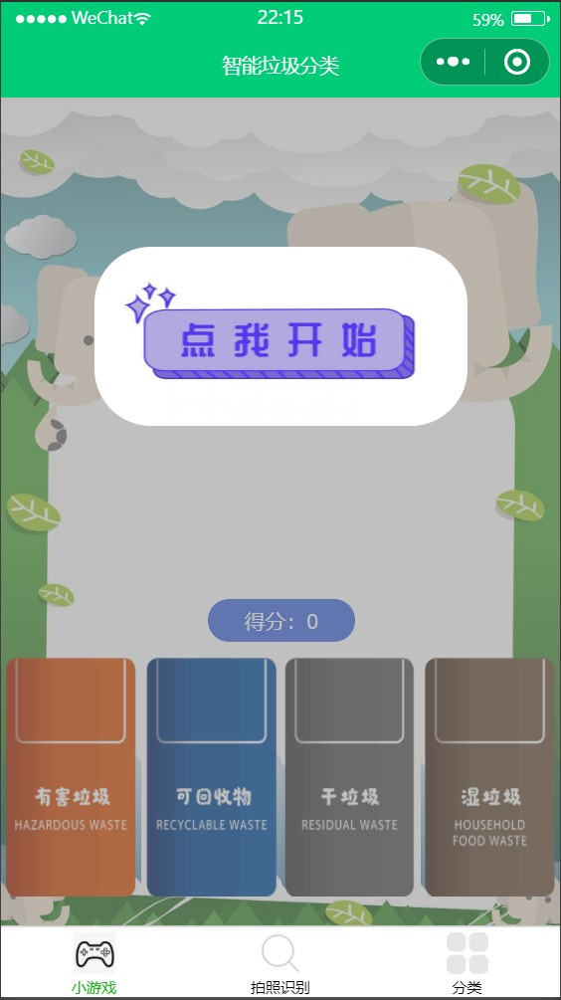
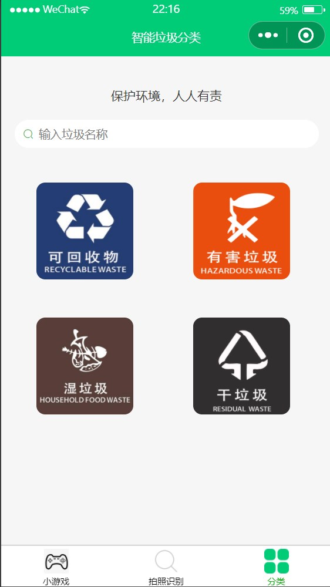
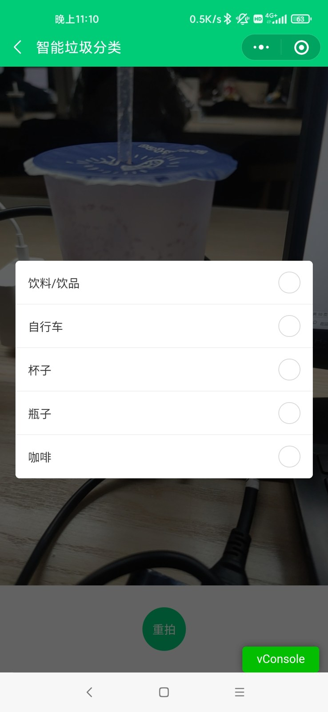
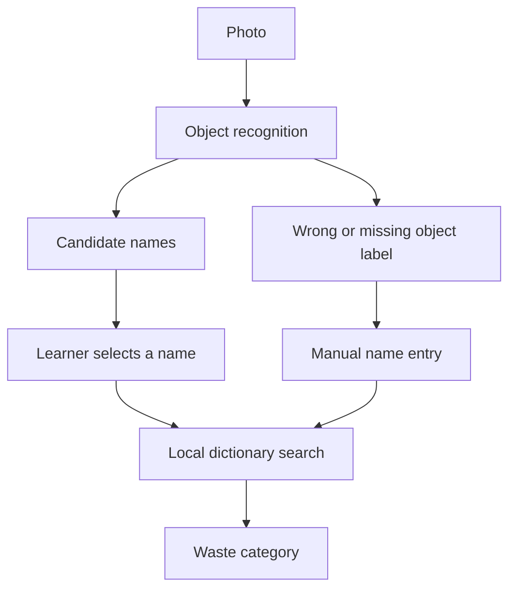

# Little Sorters — Children’s Garbage Sorting Learning System

**An interactive browser app reconstructed from a 2021–2022 WeChat mini-program project.** Learn through a sorting game, search the original waste dictionary and explore the photo-to-category workflow. Visitors need no WeChat account or Raspberry Pi to try it.

[**Open the app →**](https://jinxiao-wan.github.io/Raspberry-Pi-Children-s-Garbage-Sorting-Learning-System/) · [Project process](docs/development-process.md) · [Architecture](docs/architecture.md) · [Original WeChat source](legacy/wechat/) · [Source audit](docs/source-audit.md)

> The Pages link becomes live after the repository owner enables **Settings → Pages → Source: GitHub Actions**. The deployment workflow is included.

## Try the app

1. **Play & learn:** start an eight-object challenge, drag an object into a bin or tap the bin. Correct answers earn 10 points; wrong answers lose 10. Read the explanation before moving on. Your best score stays on your device.
2. **Find a bin:** search Chinese names across the full original dictionary, or English names for the curated game objects. Filter by category.
3. **Photo lab:** run a recorded-example walkthrough, select an object name, then see its waste classification. Upload a local photo and enter its name to explore the same lookup step.
4. **Project story:** view original screenshots, requirements, implementation stages and recognition limitations. Switch between English and Chinese.

The public photo lab is a **labelled recorded-example demonstration**, not live AI inference. An optional local Node server supports real Baidu recognition with your own keys. Images are sent to Baidu only when the user explicitly clicks the live-recognition button. There is no public upload service or account system.

The app includes a web app manifest and service worker for installation in supporting browsers and offline access after the first online visit.

## The original project

| Field | Evidence from the supplied archive |
|---|---|
| Original title | 基于树莓派的“垃圾分类学习系统” — Raspberry Pi based garbage sorting learning system |
| Context | East China University of Science and Technology, Innovation Practice Education project |
| Intended audience | Children aged 3–14, with utility for adults |
| Implemented platform | WeChat mini program |
| Supervisor | Zhou Jiale / 周家乐 |
| Jinxiao Wan’s contribution | Sorting game, scoring/feedback and integration with a teammate’s recognition feature |
| Teammate contribution | Photo-recognition feature, as credited by Wan’s final report |
| Main functions | Game, Baidu image/voice recognition code, dictionary search and category browsing |
| Reconstruction | Standalone bilingual web app, local recognition adapter, offline support and documented process |

The archive contains no verified Pi GPIO software, wiring diagram, hardware photograph or completed Pi prototype. Raspberry Pi is retained in the repository’s original project identity. Running the rebuilt app in a Pi browser is a **new deployment option**, described in [the kiosk guide](docs/raspberry-pi.md).

## Original interface and results

| Sorting game | Category library | Recognition test |
|---|---|---|
|  |  |  |

The original project used Shanghai-style **recyclables, hazardous, wet/food and dry/residual** categories. This repository preserves the archived educational model; it does not claim to be current municipal disposal guidance. The original dictionary also includes construction, bulky and non-household groups.

## How recognition works



Baidu recognises the object rather than directly identifying a waste category. The report documents errors caused by yellow tissue and background objects. A correct-looking object label can still produce an ambiguous or missing dictionary match. [Read the test story](docs/development-process.md#recognition-tests).

## Run locally

With **Node.js 22 or later**, no runtime dependencies are required:

```bash
npm start
```

Open `http://127.0.0.1:8080`. The app works without API keys. To enable live recognition, set `BAIDU_API_KEY` and `BAIDU_SECRET_KEY` in the server environment, then restart. See [recognition setup](docs/recognition.md). Never put keys in `web/` or commit them.

```bash
npm test
```

GitHub Actions additionally checks the complete game, search, photo workflow, gallery, English/Chinese interface, desktop/mobile layout and offline access. Its `app-previews` artifact contains browser screenshots.

## Repository map

| Directory | Contents |
|---|---|
| `web/` | App, assets, original dictionary, curated bilingual game objects and offline worker |
| `server/` | Optional local server and Baidu adapter |
| `legacy/wechat/` | Primary original mini program, with historical keys/cloud identifiers replaced |
| `docs/` | Reconstruction audit, visual provenance, process, architecture and deployment guides |
| `tests/` | Core, server and browser checks |
| `.github/workflows/` | Validation and GitHub Pages publishing |

## Provenance and credit

Source: the user-provided `创新育人.zip`, including Jinxiao Wan’s final report, the companion report and `垃圾分类小程序2`. The archive’s upstream README points to [a mini-program implementation article](https://www.jianshu.com/p/af26c1af62f7). Legacy code, ColorUI assets and the dictionary contain third-party material; their authorship is not claimed as entirely original. No blanket open-source licence is assigned to recovered material whose licence was not supplied.

Screenshots are original report evidence. Credential/account screenshots and full unredacted reports are intentionally excluded. The new app is a 2026 reconstruction, not a claim that its additional features existed in 2021.
