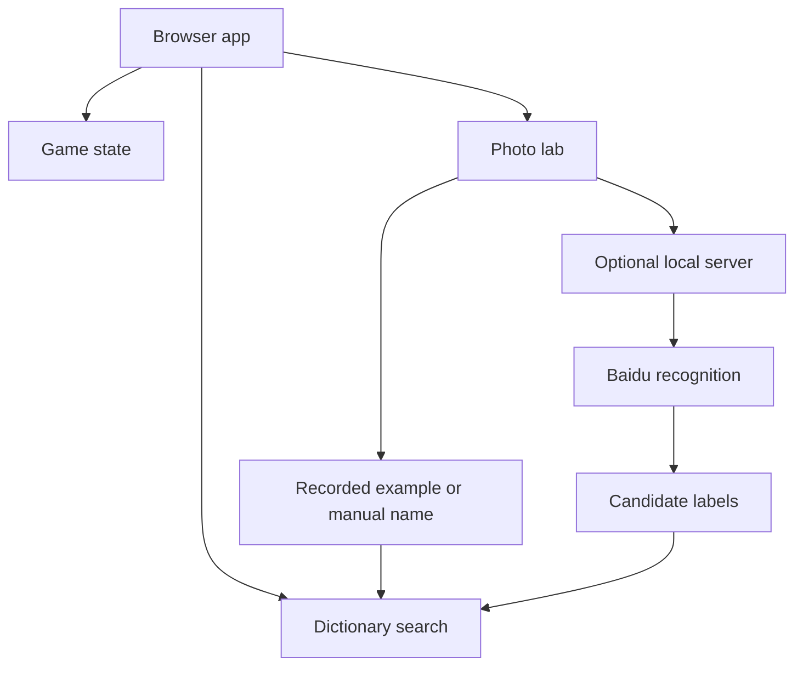

# System architecture

The reconstruction makes the documented mini-program experience accessible in a normal browser. It preserves the learning loop and object-name-to-category lookup while replacing WeChat-only APIs and unavailable remote game services.

| Concern | Archived implementation | Browser reconstruction |
|---|---|---|
| Navigation | WeChat tabBar | Hash routes for play, search, photo and story |
| Game objects | Remote catalog/test endpoints | Sixteen bilingual curated objects; eight unique objects per round |
| Input | Movable view and touch coordinates | Desktop drag/drop plus touch/keyboard bin buttons |
| Feedback | Toasts and remote sound files | Visible explanation and score feedback; no sound dependency |
| Score | +10 / −10 | Same scoring; local best score |
| Search | Chinese substring matching | Full archived Chinese dictionary, exact-match ranking and curated English aliases |
| Recognition | Baidu via WeChat cloud token function | Recorded-example public demo; optional local server uses real Baidu API |
| Image capture | WeChat camera | Native browser file/camera picker |
| Storage | Platform APIs | localStorage for best score; service worker for app files |
| Hosting | WeChat | GitHub Pages or local Node server |

The public site has no backend. Uploaded files remain local unless the optional server is configured and the user deliberately sends an image for live recognition. The server binds to loopback, keeps keys in environment variables, accepts JPEG/PNG up to 4 MB, rejects cross-origin requests and does not write images to disk. It is intended for local demonstrations, not exposed as an authenticated production service.

The Baidu adapter is covered with mocked provider responses. Real provider calls require fresh credentials and have not been verified against the original expired/account-specific service. The rebuilt app does not reproduce original voice recognition; the legacy source retains that code.
