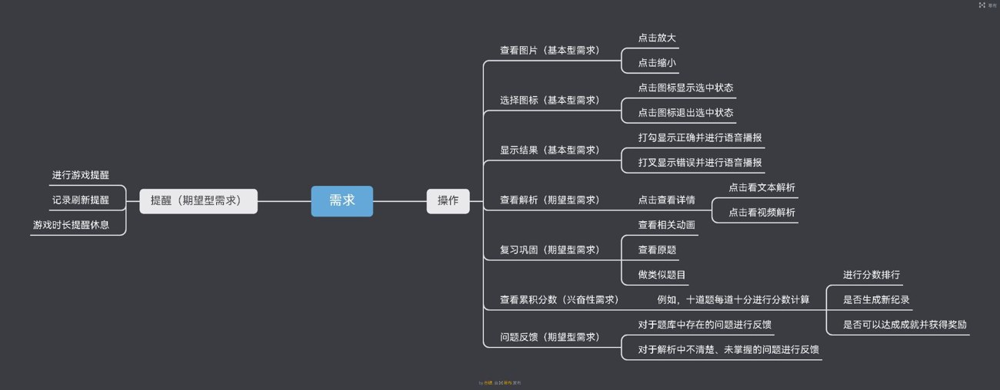
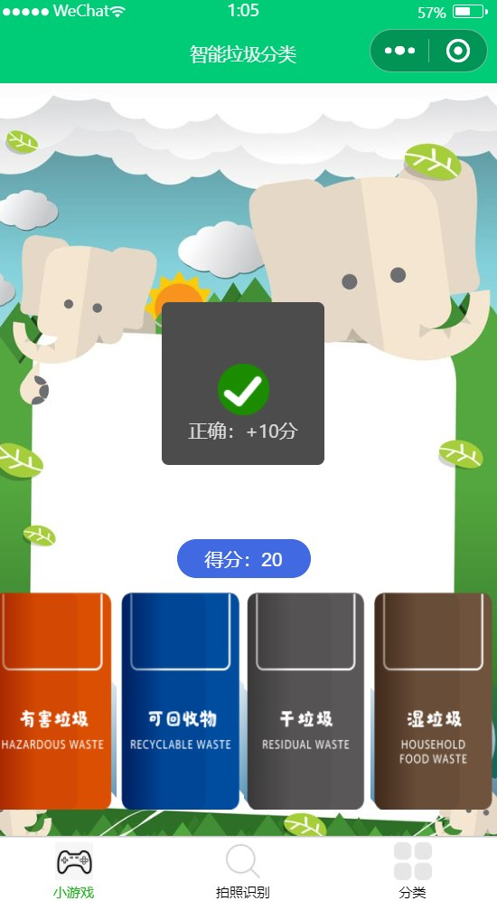
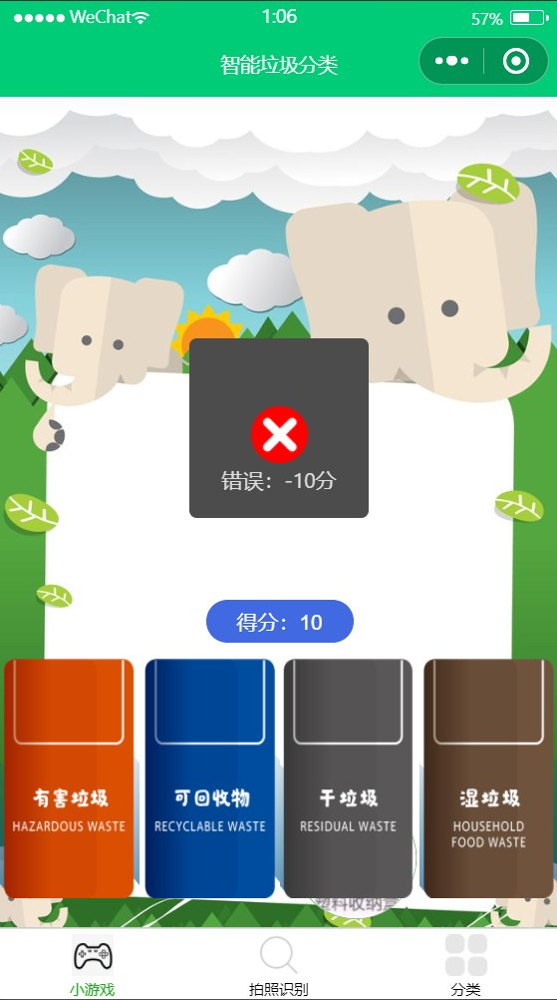
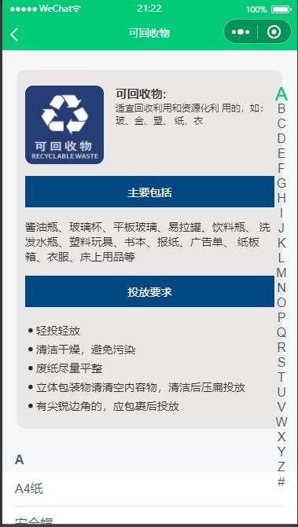
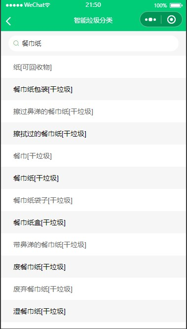
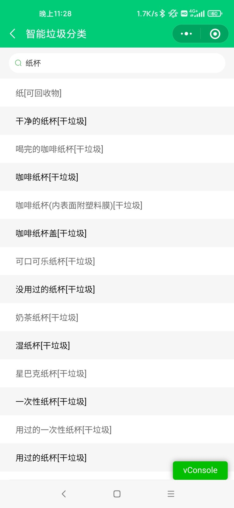
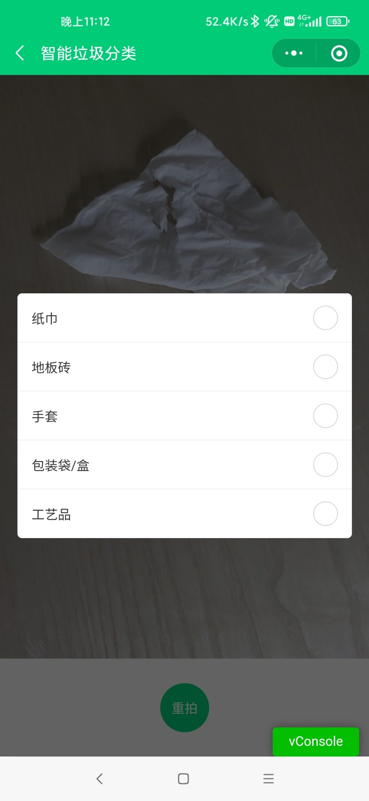
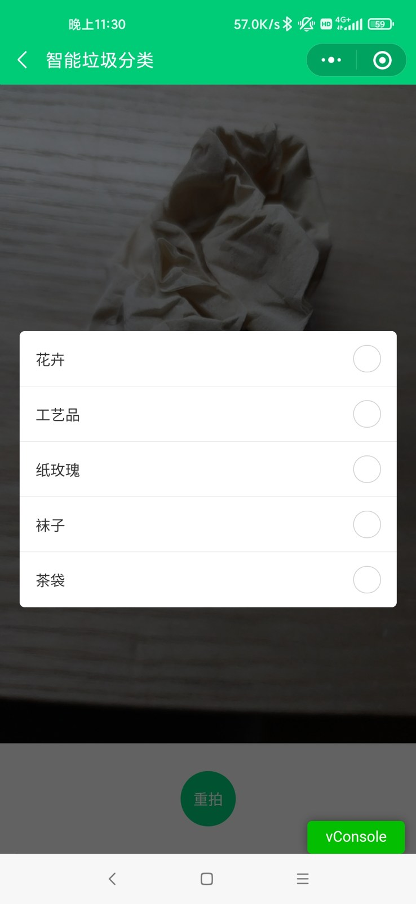
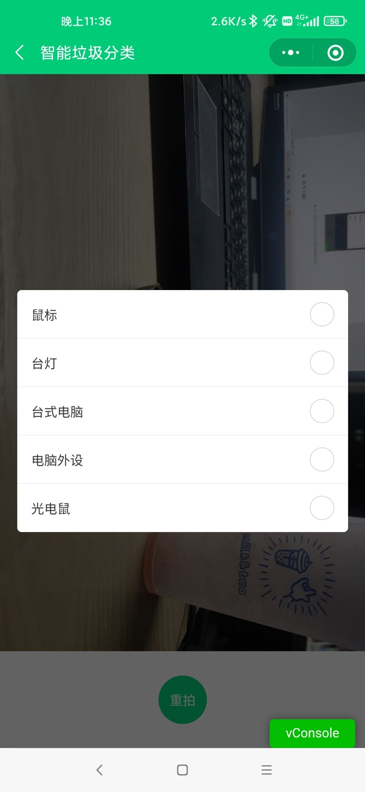

# Development process

## Original work in 2021–2022

The report’s goal was to help children learn four-category garbage sorting through play and offer convenient photo and text lookup. Jinxiao Wan’s report explicitly credits her own game implementation and integration with a teammate’s photo-recognition work. The reconstruction preserves that team distinction.

### 1 Understand the learner

The team reviewed several requirement models, then combined exhaustive exploration with the Kano model. Showing an object, selecting a bin and displaying results were basic needs. Explanations, review and feedback were desired features; rankings were proposed enhancements, not all completed.

### 2 Build the game

The mini program shows a start screen, requests an object, displays four bins and accepts a dragged or tapped answer. Correct choices add 10 points and play a positive sound; incorrect choices subtract 10 and play a negative sound.

| Start | Correct | Incorrect |
|---|---|---|
|  |  |  |

The report describes broken remote images and domain/certificate failures during development. The browser rebuild packages local content so the demonstration does not depend on those historical endpoints. The archive’s `main.py` contains WXML markup, not an executable Raspberry Pi Python game.

### 3 Build classification and lookup

A borrowed dictionary groups Chinese waste names by category and initial letter. Search bridges an object name to a waste classification. The rebuild retains the complete library and adds a small English alias set for the game objects.

| Category browsing | Keyword search |
|---|---|
|  |  |

### 4 Connect photo recognition

The original camera function sends an encoded image to Baidu object recognition. The learner selects a candidate name, which is passed to dictionary search. The report records cloud-function configuration errors during integration and shows successful tests. Raw credentials embedded in the archive are removed from published copies.

## Recognition tests

| Cup recognition | Cup lookup | Tissue recognition |
|---|---|---|
|  |  |  |

The report notes two important failure patterns: a yellow tissue was not identified as reliably as a white one; objects outside the central photo subject could be overshadowed by background content. No quantitative benchmark, training dataset, accuracy rate or custom trained model is supplied.

| Colour limitation | Background limitation |
|---|---|
|  |  |

## Reconstruction in 2026

1. Inventory the archive and read both final reports and requirement notes.
2. Select the integrated `垃圾分类小程序2` as the primary recoverable source.
3. Sanitize credentials and preserve the legacy implementation with hashes.
4. Rebuild navigation, game, dictionary search and photo workflow as a browser app.
5. Add bilingual text, explanations, local best score and offline installation support.
6. Add an optional server adapter for real recognition without publishing keys.
7. Test the app, capture browser previews and prepare GitHub Pages deployment.

The public photo walkthrough uses selected report labels and shows no fabricated confidence values. Uploaded images are previewed locally and can be classified by manual name entry. The optional server is a separate live-recognition path. Raspberry Pi kiosk deployment is new work and does not establish that Pi hardware was completed in the original project.
